<p align="center">
  
</p>

<h1 align="center"> SDG-13 Climate Action</h1>

<p align="center">
  <strong>A JavaFX Desktop Application for Climate Change Education & Awareness</strong>
</p>

<p align="center">
  <a href="#-about"></a>
  
  
  
  
</p>

<p align="center">
  <a href="#-features">Features</a> •
  <a href="#-tech-stack">Tech Stack</a> •
  <a href="#-getting-started">Getting Started</a> •
  <a href="#-project-structure">Project Structure</a> •
  <a href="#-screenshots">Screenshots</a> •
  <a href="#-contributing">Contributing</a> •
  <a href="SYSTEM_DOCUMENTATION.md">System Documentation</a>
</p>

---

## 📖 About

**SDG-13 Climate Action** is a desktop application built with **JavaFX** that serves as an interactive educational platform aligned with the **United Nations Sustainable Development Goal 13 — Climate Action**. The application aims to raise awareness about climate change by providing comprehensive educational content on key topics such as mitigation, adaptation, impact reduction, and early warning systems.

The platform features a role-based system with both **user** and **admin** portals, enabling content management and dynamic information delivery.

> *"Take urgent action to combat climate change and its impacts."*  
> — United Nations SDG 13

---

## ✨ Features

<table>
  <tr>
    <td align="center" width="33%">
      <h3>🔐 Authentication</h3>
      <p>Secure login system with separate User & Admin access portals</p>
    </td>
    <td align="center" width="33%">
      <h3>📚 6 Educational Modules</h3>
      <p>Covers Education, Awareness, Human Impact, Adaptation, Impact Reduction & Early Warning</p>
    </td>
    <td align="center" width="33%">
      <h3>🔍 Smart Search</h3>
      <p>Real-time search across all climate topics with keyword matching</p>
    </td>
  </tr>
  <tr>
    <td align="center" width="33%">
      <h3>🛠️ Admin Dashboard</h3>
      <p>Full content management — create, edit & update educational material</p>
    </td>
    <td align="center" width="33%">
      <h3>💬 Feedback System</h3>
      <p>Built-in user feedback form for suggestions and engagement</p>
    </td>
    <td align="center" width="33%">
      <h3>🔗 Share & Copy</h3>
      <p>One-click sharing with clipboard copy of SDG 13 UN resource link</p>
    </td>
  </tr>
</table>

---

## 🛠 Tech Stack

| Component          | Technology                                                                    |
| :----------------- | :---------------------------------------------------------------------------- |
| **Language**        | Java 21                                                                       |
| **UI Framework**    | JavaFX 21                                                                     |
| **UI Extensions**   | ControlsFX 11.1.2                                                             |
| **Build Tool**      | Apache Maven 3.9+                                                             |
| **Architecture**    | MVC (Model-View-Controller)                                                   |
| **View Layer**      | FXML (18 view files)                                                          |
| **Data Storage**    | File I/O (Text-based persistence)                                             |
| **Testing**         | JUnit 5 (Jupiter 5.9.2)                                                       |

---

## 🚀 Getting Started

### Prerequisites

Ensure you have the following installed:

- ☕ **Java Development Kit (JDK) 21** or later — [Download](https://adoptium.net/)
- 📦 **Apache Maven 3.9+** — [Download](https://maven.apache.org/download.cgi)
- 💻 **Git** — [Download](https://git-scm.com/)

### Installation

```bash
# 1. Clone the repository
git clone https://github.com/your-username/SDG-13-Climate-Action.git
cd SDG-13-Climate-Action

# 2. Build the project
mvn clean install

# 3. Run the application
mvn clean javafx:run
```

> [!TIP]
> If you're using **IntelliJ IDEA**, simply open the project as a Maven project and run the `Application.java` main class directly.

### Default Credentials

| Role    | Username | Password |
| :------ | :------- | :------- |
| **User**  | `123`      | `123`      |
| **Admin** | —        | `123`      |

---

## 📁 Project Structure

```
SDG-13-ver5/
├── 📄 pom.xml                          # Maven project configuration
├── 📄 mvnw / mvnw.cmd                  # Maven wrapper scripts
├── 📄 Page_One_Data.txt                 # Education & Awareness content
├── 📄 Page_Two_Data.txt                 # Awareness-Raising content
├── 📄 Page_Three_Data.txt               # Human Impact content
├── 📄 Page_Four_Data.txt                # Adaptation Planning content
├── 📄 Page_Five_Data.txt                # Impact Reduction content
├── 📄 Page_Six_Data.txt                 # Early Warning content
│
└── src/main/
    ├── java/
    │   ├── module-info.java             # Java module descriptor
    │   └── com/example/sdg13ver5/
    │       ├── Application.java         # 🚀 Main entry point (JavaFX Application)
    │       ├── Controller.java          # 🎮 Primary controller (login, pages, nav)
    │       ├── Controller2.java         # 🔍 Search controller (keyword filtering)
    │       ├── Controller3.java         # 🛠️ Admin navigation controller
    │       └── Controller4.java         # 📝 Admin content editor controller
    │
    └── resources/com/example/sdg13ver5/
        ├── start.fxml                   # Login screen
        ├── mainpage.fxml                # Main dashboard
        ├── page1.fxml — page6.fxml      # Educational content pages
        ├── search.fxml                  # Search interface
        ├── feedbackpage.fxml            # Feedback form
        ├── postfeedback.fxml            # Feedback confirmation
        ├── Copylink.fxml                # Share/copy link dialog
        ├── adminlogin.fxml              # Admin login screen
        ├── adminpage.fxml               # Admin dashboard
        ├── adminpage1.fxml — adminpage6.fxml  # Admin content editors
        └── image/                       # Application assets & icons
```

---

## 🏗 Architecture

The application follows the **MVC (Model-View-Controller)** design pattern:

```mermaid
graph TD
    A[Application.java<br/>Entry Point] --> B[start.fxml<br/>Login View]
    B --> C{Authentication}
    C -->|User Login| D[mainpage.fxml<br/>Main Dashboard]
    C -->|Admin Login| E[adminpage.fxml<br/>Admin Dashboard]
    
    D --> F[Controller.java]
    F --> G[📚 Page 1-6<br/>Educational Content]
    F --> H[🔍 Search<br/>Controller2.java]
    F --> I[💬 Feedback]
    F --> J[🔗 Share Link]
    
    E --> K[Controller3.java<br/>Admin Navigation]
    K --> L[Controller4.java<br/>Content Editor]
    L --> M[📄 Text Files<br/>Data Persistence]
    M --> G

    style A fill:#3F7E44,color:#fff
    style D fill:#4A90D9,color:#fff
    style E fill:#E8A838,color:#fff
    style M fill:#D9534F,color:#fff
```



### Controllers Overview

| Controller           | Responsibility                                                   |
| :------------------- | :--------------------------------------------------------------- |
| `Controller.java`    | User authentication, page navigation, feedback, sharing          |
| `Controller2.java`   | Search functionality with real-time keyword filtering            |
| `Controller3.java`   | Admin panel navigation between content editor pages              |
| `Controller4.java`   | Admin content management — writes educational data to text files |

---

## 📚 Educational Modules

The application covers **6 key targets** of SDG 13:

| #  | Module                  | Description                                                                              |
| :- | :---------------------- | :--------------------------------------------------------------------------------------- |
| 1  | **Improve Education**   | Climate Change Education (CCE) across early childhood, primary & secondary levels         |
| 2  | **Awareness-Raising**   | Strategies for building public awareness on climate issues                                |
| 3  | **Human Impact**        | Human and institutional capacity building for climate action                              |
| 4  | **Adaptation**          | Planning and implementing climate adaptation strategies                                  |
| 5  | **Impact Reduction**    | Reducing the adverse impact of climate-related hazards                                   |
| 6  | **Early Warning**       | Strengthening early warning systems and disaster risk management                          |

---

## 🔧 Configuration

### Customizing Content

Educational content is stored in plain text files at the project root. Admins can edit content either through the **Admin Dashboard** in the application or by directly editing:

```
Page_One_Data.txt     →  Improve Education
Page_Two_Data.txt     →  Awareness-Raising
Page_Three_Data.txt   →  Human Impact
Page_Four_Data.txt    →  Adaptation
Page_Five_Data.txt    →  Impact Reduction
Page_Six_Data.txt     →  Early Warning
```

---

## 🤝 Contributing

Contributions are welcome! Here's how you can help:

1. **Fork** the repository
2. **Create** a feature branch (`git checkout -b feature/amazing-feature`)
3. **Commit** your changes (`git commit -m 'Add amazing feature'`)
4. **Push** to the branch (`git push origin feature/amazing-feature`)
5. **Open** a Pull Request

> [!NOTE]
> Please ensure your code follows the existing project structure and includes appropriate comments.

---

## 📄 License

This project is licensed under the **MIT License** — see the [LICENSE](LICENSE) file for details.

---

## 🙏 Acknowledgements

- 🌐 [United Nations — SDG 13](https://sdgs.un.org/goals/goal13) — Climate Action goal reference
- ☕ [OpenJFX](https://openjfx.io/) — JavaFX open-source framework
- 🎛️ [ControlsFX](https://controlsfx.github.io/) — Custom JavaFX UI controls
- 🏫 **Taylor's University** — Object-Oriented Programming course

---

<p align="center">
  <strong>Built with ❤️ for a sustainable future</strong>
</p>

<p align="center">
  <sub>⭐ Star this repo if you found it useful! ⭐</sub>
</p>
