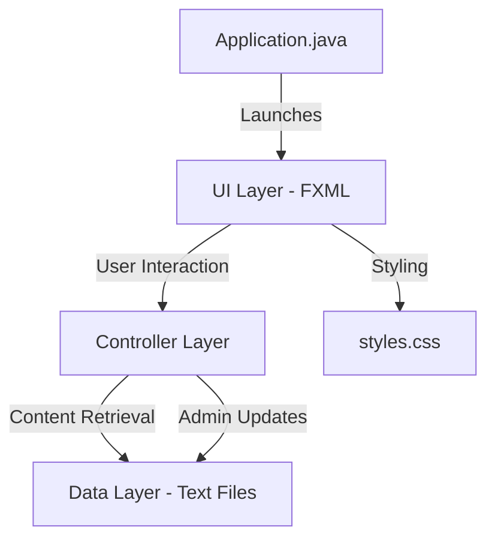

# SDG-13 Climate Action: System Documentation

This document provides a comprehensive technical overview and explanation of the **SDG-13 Climate Action** application. It covers the architecture, core components, data management, and feature implementation.

---

## 1. System Overview

The **SDG-13 Climate Action** application is a desktop-based educational platform designed to promote awareness and action regarding the United Nations Sustainable Development Goal 13. It provides users with access to educational modules while allowing administrators to manage and update content dynamically.

### Core Objectives
*   **Education**: Provide structured information on climate targets.
*   **Accessibility**: Offer a clean, intuitive desktop interface.
*   **Manageability**: Allow admins to update educational content without modifying code.
*   **Engagement**: Support user feedback and resource sharing.

---

## 2. Technical Architecture

The system is built using **Java 21**, **JavaFX 21**, and **Maven**. It follows a strict **Model-View-Controller (MVC)** design pattern to ensure separation of concerns.

### Architecture Diagram

### Components
1.  **View (FXML)**: Defines the layout and structure of the user interface.
2.  **Controller (Java)**: Handles user interaction logic, navigation, and data flow.
3.  **Model (Text Files)**: Acts as the persistent storage for educational data (Pages 1-6).
4.  **Styling (CSS)**: A global design system using modern tokens and components.

---

## 3. Detailed Component Breakdown

### 🚀 Application Entry Point (`Application.java`)
*   Inherits from `javafx.application.Application`.
*   Initializes the primary stage and loads `start.fxml` (the login screen).
*   Applies the global CSS stylesheet and centers the window on the screen.

### 🎮 Primary Controller (`Controller.java`)
The heart of the application, managing:
*   **Authentication**: Validates User (`123`/`123`) and Admin (password: `123`) logins.
*   **Navigation Logic**: Handles transitions between the login screen, main dashboard, and educational pages.
*   **Collapsible Rail**: Implements a responsive navigation sidebar (240px expanded to 64px collapsed).
*   **View Loading**: Uses `FXMLLoader` to swap content within a central `display1` Pane.
*   **Feedback & Sharing**: Manages the feedback form state and clipboard integration.

### 🔍 Search Controller (`Controller2.java`)
*   **Keyword Filtering**: Implements real-time filtering of educational topics using Java Streams.
*   **Dynamic List**: Updates a `ListView` based on user input.
*   **Navigation Bridge**: Communicates back to the primary controller to open the requested page.

### 🛠️ Admin Controllers (`Controller3.java`, `Controller4.java`)
*   **Navigation**: `Controller3` handles movement between different module editors.
*   **Content Management**: `Controller4` uses `BufferedWriter` to overwrite the `Page_X_Data.txt` files, ensuring changes are saved immediately to disk.

---

## 4. Data Management & Persistence

The system uses a **File-based Persistence** model instead of a database to maintain simplicity and portability.

### Educational Data
*   Files: `Page_One_Data.txt` through `Page_Six_Data.txt`.
*   **Read Workflow**: When a user clicks a module, `Controller.java` reads the first line of the corresponding text file and displays it in a stylized `Label` within the content area.
*   **Write Workflow**: When an admin saves changes in the dashboard, `Controller4.java` overwrites the file content with the text from the `TextArea`.

### Feedback Logic
*   Feedback is currently handled in-memory and transitions to a "Post-Feedback" success screen. 
*   *Future Improvement*: Could be appended to a `feedback.log` file.

---

## 5. UI/UX & Design System

The application features a premium design system managed through `styles.css`.

### Key Design Tokens
*   **Primary Color**: `#166534` (SDG 13 Green).
*   **Background**: `#F3F4F6` (Light modern gray).
*   **Typography**: Consistent use of system fonts (Arial/Segoe UI) with clear hierarchy (`h1`, `h2`, `body-text`).

### Interactive Elements
*   **Collapsible Sidebar**: Uses smooth transitions to toggle between icon-only and full-text modes.
*   **Password Toggle**: Custom logic to switch between `PasswordField` and `TextField` for visibility.
*   **Hover Effects**: Subtle color shifts on buttons and navigation items to improve user feedback.

---

## 6. Logic Flows

### Authentication Flow
1. User enters credentials.
2. Controller checks for empty fields (highlights in red if empty).
3. If credentials match hardcoded values, the dashboard loads.
4. If they fail, an error message is displayed.

### Navigation Flow
1. User clicks a sidebar button.
2. `Controller.java` updates the "Active" state of the button (adds `nav-button-active` CSS class).
3. The central `Pane` (`display1`) is cleared and replaced with the new FXML view.
4. The text data is fetched from the corresponding TXT file.

---

## 7. Developer Guide: Adding a Page

To add a new educational module:
1.  **File**: Create `Page_Seven_Data.txt` in the root.
2.  **View**: Create `page7.fxml` in resources.
3.  **Controller**: 
    - Add a `button7` to `Controller.java`.
    - Create a `pageseven()` method to load the FXML and TXT.
    - Update `toggleNav()` to include the 7th button.
4.  **Admin**: Add a corresponding editor view and logic in `adminpage7.fxml` and `Controller4.java`.

---

## 8. Summary of Features

| Feature | implementation Detail |
| :--- | :--- |
| **Login** | Role-based (User/Admin) |
| **Search** | Real-time Stream-based filtering |
| **Content** | 6 modules loaded from disk |
| **Admin** | Live text editing & file persistence |
| **Share** | System clipboard integration |
| **Feedback** | Valided form with success state |
| **UI** | Global CSS with Design Tokens |
